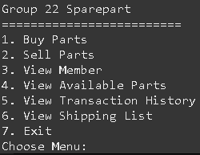

# ProjectOOP - Spareparts
Tugas Project OOP Sebelum UTS.

## Anggota
- 2440030241 - Reynald Slamat Putra
- 2440062924 - Charles Christopher
- 2440046984 - Elliot Lie Arifin

## Penjelasan Kasus: 
Zaman sekarang masih banyak toko yang menggunakan buku catatan untuk mencatat semua transaksi dan stok. hal ini sangat tidak efisien dan mempunyai resiko tinggi data hilang atau salah. Maka dari itu kami membuat sebuah aplikasi untuk melakukan pencatatan secara transparan terhadap transaksi penjualan ke pembeli dan transaksi pembelian ke supplier. Hal ini memudahkan pemilik toko untuk melihat stok, melihat data transaksi, melihat harga, melihat data member, dan memberikan potongan harga khusus untuk member.

## Class Diagram:


## Language & IDE
Java - Eclipse

## Run Locally
### Clone the project

```bash
  git clone https://github.com/CharlesKristov/DB-WebApp
```
### Open Eclipse
1. Go to File
2. Open Projects from File System
3. Directory
4. Choose the Folder Project "ProjectOOP"
5. Click Finish
6. Execute the Main.Java File and DONE!

## Documentation of the Program



## Special Thanks To Our Lecturer: MUHAMMAD FIKRI HASANI, S.Kom., M.T.
